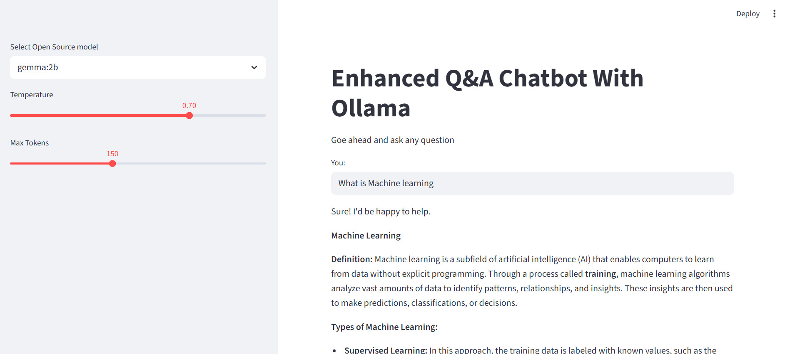

# Ollama Chatbot with Streamlit

A simple chatbot application built using Ollama's open-source language models and Streamlit for an interactive web interface.

## 📸 Screenshot


*Add your screenshot in a `screenshots` folder*

## ✨ Features

- Local LLM integration using Ollama
- Ollama embeddings for context understanding
- Clean, interactive UI with Streamlit
- Privacy-focused - all processing runs locally
- Easy model switching

## 🛠️ Tech Stack

- **Ollama** - Running open-source LLMs locally
- **Streamlit** - Web interface
- **Python** - Core language

## 🚀 Quick Start

1. **Install Ollama** from [ollama.ai](https://ollama.ai/)

2. **Pull a model**
   ```bash
   ollama pull llama2
   ```

3. **Clone and install**
   ```bash
   git clone https://github.com/yourusername/ollama-chatbot.git
   cd ollama-chatbot
   pip install -r requirements.txt
   ```

4. **Run the app**
   ```bash
   streamlit run app.py
   ```

5. **Open** `http://localhost:8501` in your browser

## 📋 Requirements

- Python 3.8+
- Ollama installed and running
- At least one Ollama model pulled

## 📁 Project Structure

```
ollama-chatbot/
├── app.py              # Main application
├── screenshots/        # App screenshots
└── README.md          # Documentation
```

## 🤝 Contributing

Contributions welcome! Fork the repo, make your changes, and submit a pull request.

## 📧 Contact

Your Name - riznxz@gmail.com

Project Link: [https://github.com/yourusername/ollama-chatbot](https://github.com/yourusername/ollama-chatbot)

---

⭐ Star this repo if you find it helpful!
